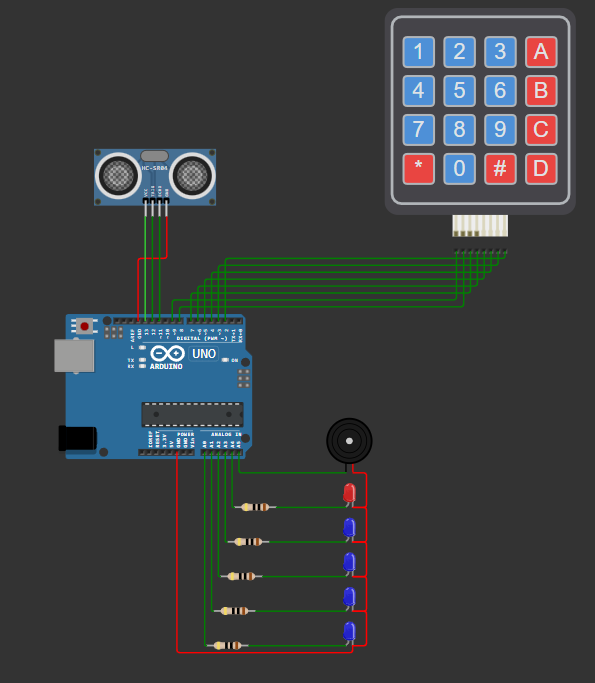

# Arduino Security Alarm System

## Overview
This project implements a security alarm system using an Arduino Uno R3. The system features password protection, motion detection, and visual/audio alerts. It's built using C++ in PlatformIO and includes multiple operating states for different security scenarios.

## Features
- 4-digit password protection system
- Motion detection using ultrasonic sensor
- Visual feedback with 4 blue LEDs and 1 red LED
- Audio alerts via buzzer
- Multiple security states:
  - STARTUP: Initial password setting
  - STANDBY: Waiting for system arming
  - WATCHING: Active monitoring
  - PRE_ALERT: Grace period for password entry
  - ALERT: Full alarm activation

## Hardware Requirements
- Arduino Uno R3
- HC-SR04 Ultrasonic Sensor
- 4x4 Matrix Keypad
- 4 Blue LEDs
- 1 Red LED
- Buzzer
- Resistors (as needed for LEDs)
- Jumper wires
- Breadboard

## Circuit Diagram

## Pin Configuration
The system uses the following pin connections:

### LED Connections
- 4 Blue LEDs (Password indication)
- 1 Red LED (Alert indication)

### Sensor Connections
- HC-SR04 Ultrasonic Sensor
  - TRIG Pin
  - ECHO Pin
  - VCC Pin

### Input Device
- 4x4 Matrix Keypad
  - Row pins (R1-R4)
  - Column pins (C1-C4)

### Output Device
- Buzzer Pin

## System States

### 1. STARTUP
- Initial state when the system boots
- Requires setting up a 4-digit password
- Blue LEDs indicate password entry progress

### 2. STANDBY
- System is idle and waiting to be armed
- Requires password entry to proceed to WATCHING state
- 10-second delay before arming

### 3. WATCHING
- Active monitoring state
- Calculates average distance using 50 measurements
- Triggers PRE_ALERT if motion is detected (distance changes by 50%)

### 4. PRE_ALERT
- Grace period state (10 seconds)
- Allows password entry to disarm
- Transitions to ALERT if no correct password is entered

### 5. ALERT
- Full alarm activation
- Visual and audio alerts active
- Requires correct password to return to STANDBY

## Installation and Setup

### Using PlatformIO
1. Install PlatformIO IDE
2. Create a new project for Arduino Uno
3. Copy the provided code files into your project
4. Install required dependencies
5. Build and upload to your Arduino

### Required Files
- `alarm.h` - Header file containing class definitions
- `alarm.cpp` - Main implementation file
- Additional helper classes (`LED`, `Logger`, `Timer`, `UltrasonicSensor`)

## Usage Instructions
1. Power up the system
2. Set initial 4-digit password during STARTUP
3. Enter password to arm the system
4. System will begin monitoring after 10-second delay
5. To disarm:
   - Enter correct password during PRE_ALERT or ALERT states
   - System returns to STANDBY mode

## Safety Features
- 10-second arming delay
- Pre-alert grace period
- Visual feedback for password entry
- Incorrect password indication
- Continuous monitoring with average distance calculation

## Contributing
Feel free to fork this project and submit pull requests for any improvements.

## License
[Specify your chosen license here]

## Author
[Your name/username here]

## Acknowledgments
- Thanks to the Arduino community
- PlatformIO development team